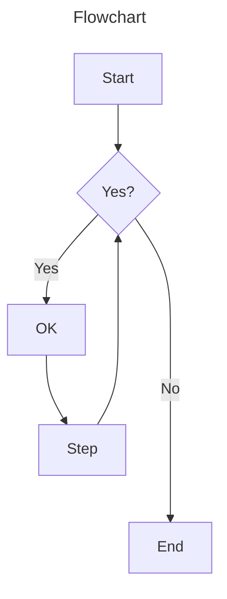

```python
print ("Bonjour le monde")
a = [1, 2, 3]
```

$$
\boxed{ e^{i\pi} + 1 = 0 }
$$


```mermaid
---
title: Flowchart
---
flowchart TD
    id1[Start] --> id2{Yes?}
    id2 -->|Yes| id3[OK]
    id3 --> id4[Step]
    id4 --> id2
    id2 ---->|No| id5[End]
```